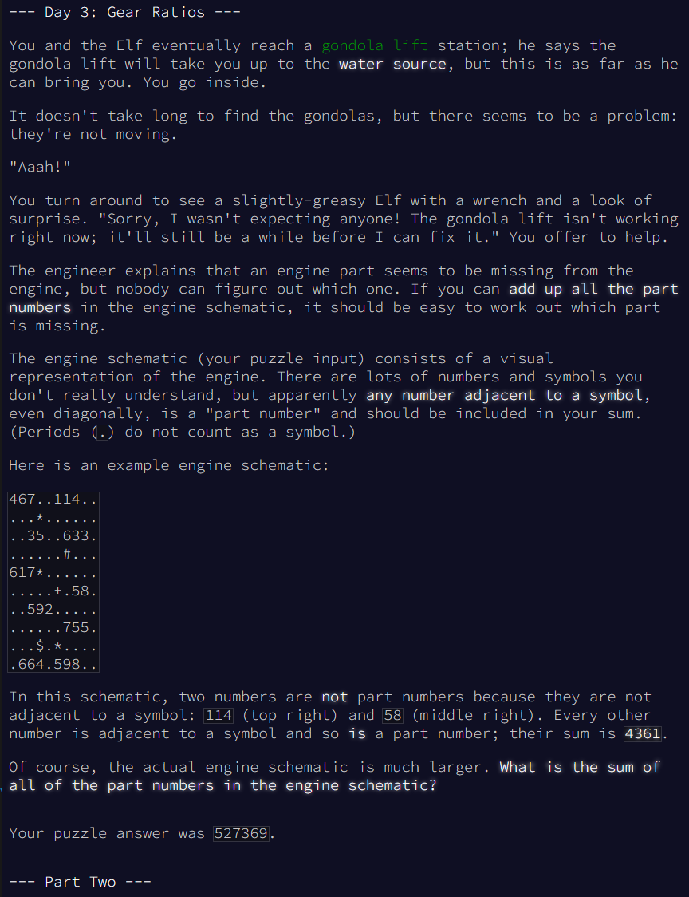
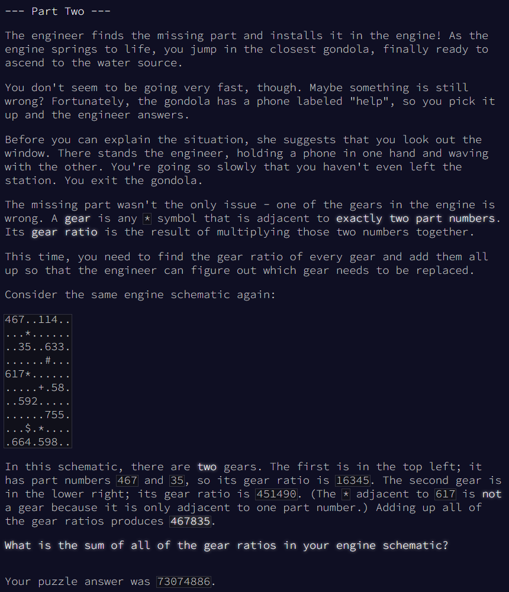

# My Notes

* Traverse the matrix row by row.
* Identify numbers (single or multiple digits) in each row.
* Check if any number is adjacent to a symbol.
* If a number is adjacent to a symbol, it is considered a part number. Add the part number to the list of part numbers and associate it with the symbol's position in the dictionary.
* Dictionary will keep track of symbol position and associated part numbers.
* If symbol position is associated with only 2 parts, it is considered a gear.
* A gear ratio is the product of the two part numbers.
* Part 1 - Return Sum of all part numbers
* Part 2 - Sum gear ratios across all gears

# Original Exercise

