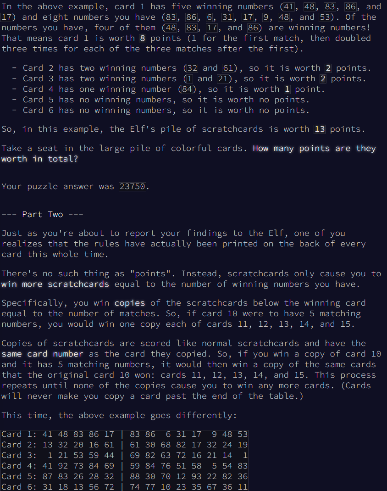

# My Notes

## Part 1
* Split the card into card number and numbers - throw away the card number.
* Split the numbers into winning numbers and your numbers.
* Convert the numbers to sets of integers.
* Use Set Intersection to find the winning numbers in your numbers, and count them.
* Calculate the points for the card. Points = 2^(n-1) where n is the number of winning numbers

## Part 2
* Keep track of total cards per instructions.
* Initialize array to be [1, 1, 1, ..] up to the initial number of cards
* Increment the appropriate index in the array when copies of cards are earned

## Things Learned
* Replaced np.array([1] * len(cards)) with np.ones(len(cards), dtype=int) for better performance.
* Used total_cards.sum() instead of sum(total_cards) for summing the NumPy array for better performance.

# Original Exercise

